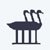
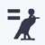

# Senet Game

This project is a Python implementation of the ancient Egyptian board game of Senet, brought to life with a graphical user interface using Pygame. It features both Human vs. Human and Human vs. AI gameplay modes.

 

## Features

*   **Graphical User Interface:** A complete UI built with Pygame, featuring a main menu, game board, and interactive elements.
*   **Ancient Egyptian Gameplay:** Experience one of the oldest known board games.
*   **Two Game Modes:** Play against another person or test your skills against an AI opponent.
*   **Special Squares:** The board includes special squares that influence the game:
    *   **House of Happiness (Square 26):** A safe square. Pieces on this square cannot be attacked.
    *   **House of Water (Square 27):** Landing here sends your piece back to the House of Rebirth (Square 15).
    *   **House of Three Truths (Square 28):** A piece on this square can only exit the board with a roll of 3.
    *   **House of Re-Atoum (Square 29):** A piece on this square can only exit the board with a roll of 2.
    *   **House of Horus (Square 30):** The final square. A piece on this square can exit the board with a roll of 1.
*   **Intelligent AI:** The AI opponent uses the Expectiminimax algorithm to make strategic decisions.
*   **Customizable Levels:** Game board layouts are loaded from a `levels.json` file, allowing for easy customization.
*   **Visual Assets:** The game includes a variety of images to create an immersive experience.

## How to Play

The objective of Senet is to be the first player to move all of your pieces off the board.

1.  **Movement:** Players take turns rolling a virtual four-sided die (sticks) to determine how many squares they can move one of their pieces.
2.  **Capturing:** If you land on a square occupied by an opponent's piece, you capture it, and your opponent's piece is moved back to the starting square.
3.  **Bearing Off:** Once a piece has passed the House of Happiness, it can be borne off the board from the last three squares with an exact roll.

## How to Run

1.  Make sure you have Python and Pygame installed.
2.  Navigate to the `senet-game` directory in your terminal.
3.  Run the game using the following command:
    ```bash
    python uid.py
    ```
4.  Choose your desired game mode from the menu.

## Project Structure

*   `uid.py`: The main entry point for the game, containing the Pygame UI and game loop.
*   `main.py`: A console-based version of the game.
*   `game/`: Contains the core game logic.
    *   `Board.py`: Represents the game board and its state.
    *   `Cell.py`: Represents a single square on the board.
    *   `SpecialSquareRules.py`: Implements the rules for the special squares.
*   `modes/`: Contains the different game modes.
    *   `HumanVsHuman.py`: The mode for two human players.
    *   `human_vs_ai.py`: The mode for playing against the AI.
*   `ai/`: Contains the AI logic.
    *   `ai_engine.py`: Implements the Expectiminimax algorithm and the heuristic evaluation function for the AI's decision-making.
*   `levels.json`: A JSON file that defines the layout of the game board.
*   `assets/`: Contains all the images used in the game.

## AI Opponent

The AI opponent is designed to provide a challenging experience. It uses the **Expectiminimax** algorithm, which is a variation of the Minimax algorithm for games with an element of chance (in this case, the dice roll).

The AI's decision-making process involves:

*   **Heuristic Evaluation:** The AI evaluates the board state based on a heuristic function that considers:
    *   **Piece Advancement:** The AI is rewarded for advancing its pieces along the board.
    *   **Special Squares:** The AI is rewarded for occupying strategic special squares and penalized for landing on unfavorable ones.
*   **Expectiminimax Search:** The AI searches several moves ahead, considering the probabilities of different dice rolls, to choose the move with the highest expected value.

## Assets

The `assets` directory contains all the visual elements of the game, including:

*   `logo.png`: The game's logo, used in the main menu and in-game header.
*   `Chess Piecesw.png`, `Chess Pieces.png`: The white and black player pieces.
*   `Board-Squaresb.png`, `Board-Squaresw.png`: The black and white board squares.
*   `senet_bg_15.png`, `senet_bg_26.png`, `senet_bg_27.png`, `senet_bg_28.png`, `senet_bg_29.png`, `senet_bg_30.png`: Background images for the special squares.
